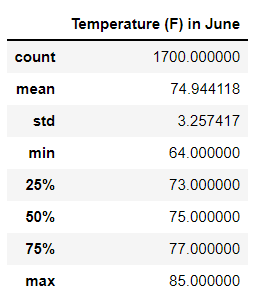

# surfs_up

## Overview

The client is looking to establish a surf and ice cream shop in Oahu, Hawaii. He has gathered past weather data of the region from a sqlite database and has provided some preliminary analysis to his backer. The backer would like to drill down into specific months of the year (June and December) to determine whether the shop will be profitable year-round.

## Purpose

To trend weather data from June and December using the data provided by the client to determine profitability of a surf and ice cream shop in Oahu.

## Results and Analysis

The Sqlite database the client provided contained 2 tables, Measurement and Station. When inspected, the Measurement table had 5 columns which included dates and temperature. The Measurement table was queried for the temperatures during the months of June and December. The resulting values were then added to a dataframe.

Using the describe function to review the high level statistics of the temperature data, the following can be determined:

 

* Count: There is almost 200 less absolute number of entries in December than in June. 
* Mean temperature: The mean temperature for the two months are relatively the same, 74.94F for June versus 71.04F for December. 
* Standard deviation: Both months has a standard deviation around 3F, meaning both June and December have the same low variability.
* Min/Max temperatures and quartiles: In June, the minimum and maximum temperatures were 64F and 85F, respectively. In December, the minimum and maximum temperatures were 56F and 83F, respectively. In June we find the lower quartile at 73F whereas the lower quartile for December is 69F. 

We can conclude that the weather does seem to cool during the month of December but the difference is not very significant.

## Summary

The client provided a sqlite database to access weather data for the island of Oahu where they envision establishing a surf and ice cream shop. They would like to provide additional temperature data to their backers to further reassure their potential investment. 

Overall, the data does not seem to show a significant temperature difference between June and December. The data thus suggests that the surf and ice cream shop would be potentially profitable year-round. 

The client had previously queried the database for precipitation during 2017. We can further query the database to review the weather (temperature and precipitation) over the years to investigate any trends there may be. It would also be interesting to sort the average precipitation and average temperatures during June and December by the weather station (as shown below). In doing so, we could possibly determine the best location to set up the shop.

